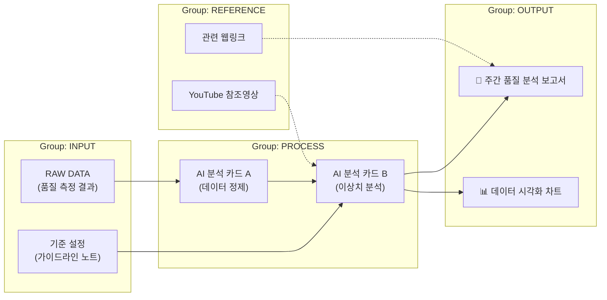

# Obsidian Canvas 입문 가이드: AI 워크플로우 설계

**Obsidian Canvas**는 흩어진 정보를 논리적인 흐름(Workflow)으로 연결하여 복잡한 업무를 시각화하는 도구입니다. 본 가이드에서는 '데이터 입력부터 AI 처리, 최종 결과 도출'까지의 논리적인 단계를 실습합니다.

## 1. 캔버스 핵심 개념
캔버스는 단순한 화이트보드가 아니라, 정보의 **[입력(Input) → 처리(Process) → 출력(Output)]** 과정을 설계하는 공간입니다.

- **입력**: 기존 노트(.md), 외부 웹페이지(URL), 이미지, PDF 등
- **처리**: 브레인스토밍 카드, AI 프롬프트 카드, 로직 연결선
- **출력**: 최종 보고서 카드, 대시보드 그룹

## 2. [실습] 품질 데이터 AI 분석 워크플로우 설계

풍산의 현장에서 발생하는 데이터를 AI로 분석하여 보고서로 만드는 과정을 논리적인 흐름으로 구성해 봅니다.

### 1단계: 데이터 소스 정의 (Input)
- **현장 데이터**: 캔버스 왼쪽에 **카드**를 생성하고 `RAW DATA: 품질 측정 결과 (CSV)`라고 입력합니다.
- **지식 베이스**: 왼쪽 파일 탐색기에서 이전에 작성한 `properties_search_manual.md` 노트를 캔버스로 드래그하여 배치합니다. (품질 기준 가이드라인 역할)

### 2단계: AI 분석 프로세스 설정 (Process)
- 중앙에 두 개의 카드를 생성하고 화살표로 연결합니다.
  1. `AI 처리 A: 비정형 데이터 정제 (Summarization)`
  2. `AI 처리 B: 이상치 분석 및 원인 추론 (Analysis)`
- **외부 참조**: 유튜브나 웹사이트에서 `생성형 AI 분석 튜토리얼` 링크를 분석 카드 근처에 배치하여 로직의 근거를 마련합니다.

### 3단계: 최종 결과물 도출 (Output)
- 오른쪽에 결과를 담을 두 개의 **카드**를 생성합니다. (캔버스에서 그룹은 최소 2개 이상의 요소가 필요합니다.)
  1. `🎯 주간 품질 분석 보고서 (Draft)`
  2. `📊 데이터 시각화 차트 (Image)`
- 분석 완료된 데이터가 각 결과물로 흐르도록 연결선을 마무리합니다.

### 4단계: 영역 그룹화 및 구조화
- 각 단계(입력, 처리, 출력)를 드래그하여 선택한 후 우클릭하여 **그룹**(Group)으로 묶습니다.
- **주의**: 캔버스에서 그룹은 2개 이상의 요소를 포함해야 생성 가능하므로, 출력 단계에서도 보고서와 차트를 함께 묶어줍니다.
- 그룹별로 색상을 다르게 지정하여(예: 입력-파랑, 처리-노랑, 출력-초록) 시각적 위계를 만듭니다.

## 3. 논리적 워크플로우 시각화 (최종 결과)

## 4. 조작 및 활용 단축키

- **도구 활용**: 하단 툴바를 통해 카드, 파일, 미디어, 웹링크를 즉시 추가할 수 있습니다.
- **연결선**: 노드를 드래그할 때 `Shift`를 누르면 직선/곡선 스타일을 변경할 수 있습니다.
- **주요 단축키**:
  - `Space + 드래그`: 화면 이동
  - `Ctrl + 휠`: 확대/축소
  - `Alt + 드래그`: 요소 복제
  - `Enter`: 선택한 카드 편집
